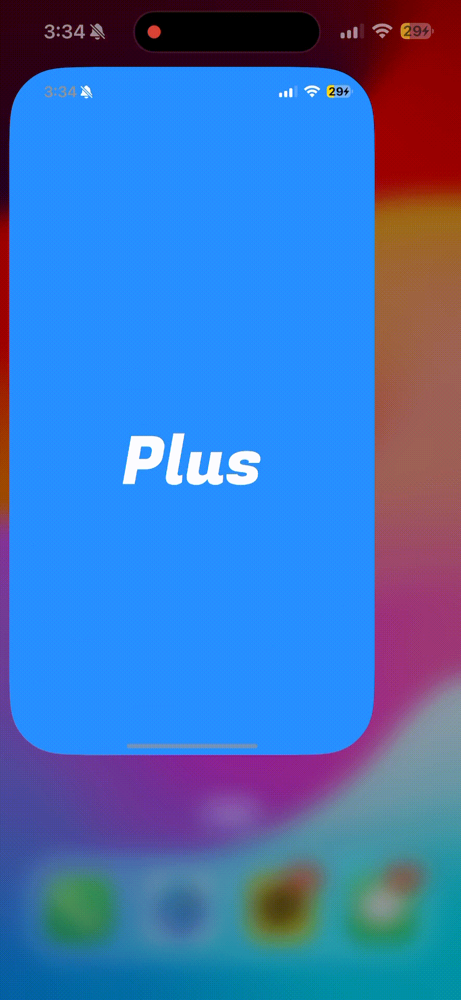
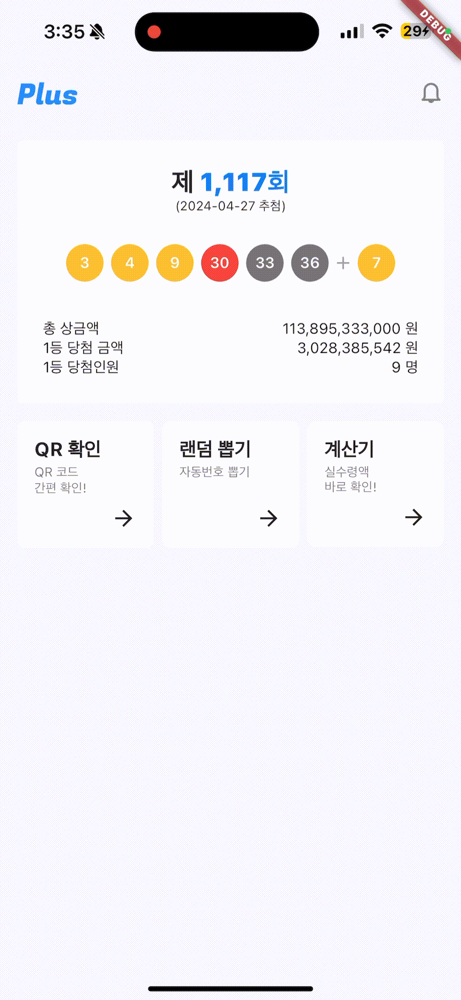

<p align="center">
  
</p>

> FE 스터디중 만들게된 로또 앱입니다.
> 간단한 앱을 만들어보며 dart 언어를 학습하고 앱 개발을 도전해보는 시간이였습니다.

# Lotto Plus App

   

## 프로젝트 소개

로또플러스는 실시간 회차별 로또당첨번호를 알려주며 실수령액을 간편하게 확인하는 앱입니다.

| 스플래시/메인                        | 실수령액 계산기                          | Qr 당첨 확인                     | 랜덤 번호 뽑기                       |
| ------------------------------------ | ---------------------------------------- | -------------------------------- | ------------------------------------ |
|  |  |  |  |

## Development Setup

**Clone this project**

```bash
# Move to your workspace
cd your-workspace

# Clone this repository:
$ git clone https://github.com/whl5105/flutter_lotto.git

# Enter in directory:
$ cd flutter_lotto

# For install dependencies:
$ flutter pub get

# Run the app:
$ flutter run

```
